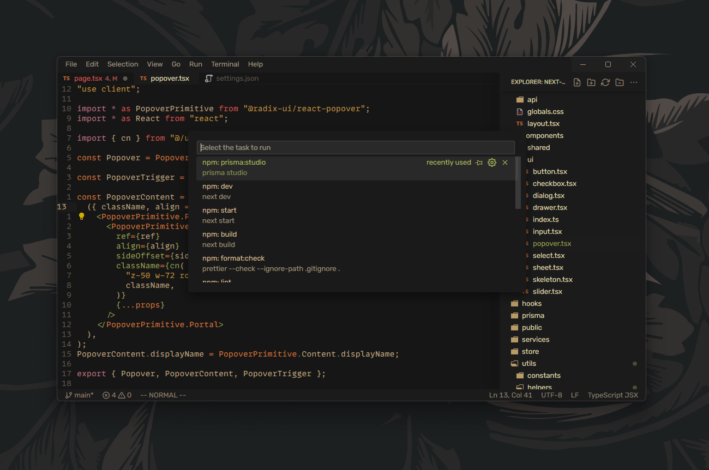

# vscode.
```c:\users\{username}\injty\vscode```

> examples:

theme: novasolarized.  
icons: salad icons.  
fonts: monolisa, robotomono nerd font.  


-----

theme: gruvbox concoctis dark medium.  
icons: gruvbox material icons.  
fonts: monaspace neon var, robotomono nerd font.  
